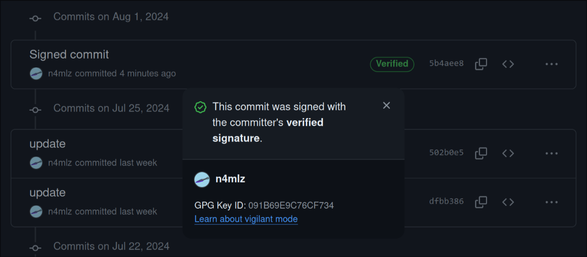

<span style="color: red">【注意】この記事はフィクションです。実在の人物･団体とは一切関係がありません。</span>

## はじめに

どうもこんにちは。n4mlz です。今回は、リーナス・トーバルズが私のリポジトリにコミットしてくれた話を書いていこうと思います。

...というのは冗談です。もちろんリーナス・トーバルズが私のリポジトリにコミットすることはありません。しかし、Git ではコミット作成者を偽装することが可能です。というわけで今回は、Git でコミット作成者を偽装する方法とその対策を書いていこうと思います。

## コミット作成者を偽装する手順

Git では、`user.name` を Auther、`user.email` を Committer として判断しています。しかし、これらの情報はご存知の通り、容易に変更可能です。

```bash
$ git config --local user.name "torvalds"
$ git config --local user.email "torvalds@linux-foundation.org"
```

ここで、何かしらをコミットしてみます。

```bash
$ git commit -m "俺がリーナス・トーバルズだ！！！"
```

するとどうでしょう。


なんと、リーナス・トーバルズが俺にコミットしているではありませんか。 ([実際のコミット](https://github.com/n4mlz/fake_commit/commit/df345d084d0087b139c8b8426637f0dc53fb50d0))

## 問題点

先ほどのコマンドは、Git のセットアップ時に設定した覚えがある方も多いかと思います。しかしここで重要なことは、特別な設定をしていない場合、これは「あなたがあなた自身の情報を正確に入力した場合」と「あなたが他の人の情報を入力した場合」の間に実質的には全く違いがないということです。

つまり、あなたが普段使っているリポジトリにおいて、あなたのコミットが本当にあなたのものであるかどうかは、あなたが設定した情報を信じるしかないということです。あなたは普段当然のように自分のアカウントを自分だと思ってコミットしているかもしれませんが、それはあくまであなたがあなた自身であるように `user.name` と `user.email` を設定しているからに過ぎなかったのです。

## 対策

どうすればこの問題を解決できるでしょうか。これには、「コミットに署名する」という方法があります。これは、コミットに GPG 署名を付与することで、コミットの正当性を確認する方法です。

GitHub では、署名として GPG 鍵と SSH 鍵をサポートしています。しかし、SSH 鍵で署名されたコミットは、GitHub においては「Verified」のステータスが表示されません ([ソース](https://docs.github.com/ja/authentication/managing-commit-signature-verification/about-commit-signature-verification)) 。そのため、ここでは GPG 鍵を利用した方法を紹介します。

### GPG 鍵の生成

GPG は GNU Privacy Guard の略で、OpenPGP 標準に基づいた暗号化ソフトウェアです。GPG を使うことで、データの暗号化やデジタル署名を行うことができます。

`gpg` コマンドを使って GPG 鍵を生成します。`gpg` コマンドがインストールされていない場合は、インストールしてください。

```
$ gpg --full-generate-key
gpg (GnuPG) 2.4.5; Copyright (C) 2024 g10 Code GmbH
This is free software: you are free to change and redistribute it.
There is NO WARRANTY, to the extent permitted by law.

Please select what kind of key you want:
   (1) RSA and RSA
   (2) DSA and Elgamal
   (3) DSA (sign only)
   (4) RSA (sign only)
   (9) ECC (sign and encrypt) *default*
  (10) ECC (sign only)
  (14) Existing key from card
Your selection?
Please select which elliptic curve you want:
   (1) Curve 25519 *default*
   (4) NIST P-384
   (6) Brainpool P-256
Your selection?
Please specify how long the key should be valid.
         0 = key does not expire
      <n>  = key expires in n days
      <n>w = key expires in n weeks
      <n>m = key expires in n months
      <n>y = key expires in n years
Key is valid for? (0)
Key does not expire at all
Is this correct? (y/N)
```

たくさん聞かれますが、デフォルトのままで問題ありません。必要があれば適宜変更してください。

進めていくと、以下のように Real name と Email address を入力するように求められます。  
Email address は、必ず GitHub に登録しているメールアドレスを入力してください。

```
GnuPG needs to construct a user ID to identify your key.

Real name: n4mlz
Email address: n4mlz.dev@gmail.com
Comment:
You selected this USER-ID:
    "n4mlz <n4mlz.dev@gmail.com>"

Change (N)ame, (C)omment, (E)mail or (O)kay/(Q)uit?
```

最後に、パスフレーズを入力して鍵を生成します。  
すると、以下のようなプロンプトが表示されるはずです。

```
gpg: directory '/home/n4mlz/.gnupg/openpgp-revocs.d' created
gpg: revocation certificate stored as '/home/n4mlz/.gnupg/openpgp-revocs.d/XXXXXXXXXXXXXXXXXXXXXXXXXXXXXXXXXXXXXXXX.rev'
public and secret key created and signed.

pub   ed25519 2024-08-01 [SC]
      XXXXXXXXXXXXXXXXXXXXXXXXXXXXXXXXXXXXXXXX
uid                      n4mlz <n4mlz.dev@gmail.com>
sub   cv25519 2024-08-01 [E]
```

これで GPG 鍵の生成が完了しました。

### GPG 公開鍵の取得

次に、公開鍵を取得します。  
まず以下のコマンドを実行して、鍵のリストを取得します。

```
$ gpg --list-secret-keys --keyid-format=long
gpg: checking the trustdb
gpg: marginals needed: 3  completes needed: 1  trust model: pgp
gpg: depth: 0  valid:   1  signed:   0  trust: 0-, 0q, 0n, 0m, 0f, 1u
/home/n4mlz/.gnupg/pubring.kbx
------------------------------
sec   ed25519/091B69E9C76CF734 2024-08-01 [SC]
      XXXXXXXXXXXXXXXXXXXXXXXXXXXXXXXXXXXXXXXX
uid                 [ultimate] n4mlz <n4mlz.dev@gmail.com>
ssb   cv25519/XXXXXXXXXXXXXXXX 2024-08-01 [E]
```

GPG では、鍵を複数持つことができます。先ほど生成したものは「主鍵」というもので、主鍵を使用して副鍵を作成することもできます (詳しくは [こちら](https://blog.livewing.net/gpg-life) を参照してください) 。

GPG では複数ある鍵を、ID で区別します。上記の例では、`091B69E9C76CF734` の部分が ID です。こちらの ID は公開しても問題ないようです。

次に、先ほどの GPG キー ID を指定して公開鍵をエクスポートします。

```
$ gpg --armor --export 091B69E9C76CF734
-----BEGIN PGP PUBLIC KEY BLOCK-----

mDMEZqtXABYJKwYBBAHaRw8BAQdA+0cBla4EFKMrvg+MA0TDUhoUOXTc/YelBOKu
ozQ2CBO0G240bWx6IDxuNG1sei5kZXZAZ21haWwuY29tPoiTBBMWCgA7FiEEySyf
4pEtHePkAx+7CRtp6cds9zQFAmarVwACGwMFCwkIBwICIgIGFQoJCAsCBBYCAwEC
HgcCF4AACgkQCRtp6cds9zTQ1gD/YsFRdNWkOOBME0PWxLM+cn+ZUuD0mIWLfNbT
QPdCX9MA/R0afqk/y6xYwbFM3jsxDOTBjz137GOvc6ww95HtH4EGuDgEZqtXABIK
KwYBBAGXVQEFAQEHQD9XlsebzhjsGCTcsEkOhiA9+9g3I3dXI80xzVn7GS8MAwEI
B4h4BBgWCgAgFiEEySyf4pEtHePkAx+7CRtp6cds9zQFAmarVwACGwwACgkQCRtp
6cds9zSqcAEAuaiuT0UqdvceeVE2U1wKdk+nKIoLMhQBWDCSsXHZgq0BALUZs99G
MnRBvYw+JWPXqWy9z91YwU6QKhSOUo7Uo/oK
=/4bP
-----END PGP PUBLIC KEY BLOCK-----
```

これで GPG 公開鍵の取得が完了しました。

### GitHub に GPG 鍵を登録

上で取得した公開鍵を GitHub に登録します。[こちら](https://github.com/settings/gpg/new) から GPG 鍵を登録してください。

### Git の設定

手元の Git で GPG 署名する時に使用する GPG キーの ID を指定しておきます。

```bash
$ git config --global user.signingkey 091B69E9C76CF734
```

これで、Git でコミットに署名する準備が整いました。

### 実際にコミットに署名してみる

コミット時に `-S` オプションを付けることで、コミットに署名することができます。  
コミットの署名時には、パスフレーズの入力が必要です。

```bash
$ git commit -S -m "Signed commit"
```

push して GitHub で確認してみます。


おぉ！ Verified と表示されています！これで、コミットの正当性を確認することができました。やっぱり私はリーナス・トーバルズにはなれなかったんですね。

ちなみに、以下のように GPG キー ID を確認することもできます。



## まとめ

今回は、Git でコミット作成者を偽装する方法とその対策について紹介しました。コミットは作成日時や内容、作成者などが用意に改ざんできるため、むやみに信用してはいけないということですね。(例えばコミットの日時をいじって、GitHub の草を過去改変 or 未来に草を生やすなどができます)

また鍵が盗まれていない限りは Verified タグがついていればコミット作成者が本人であることが保証できるということも、覚えておくと良いですね。

それではまた今度！

## 参考

- [Git でコミット作成者を偽装する方法／署名付きコミットでの対策](https://qiita.com/s6n/items/bb869f740a53a3bf169e)
- [GitHub署名付きでコミットしてかっこつける](https://zenn.dev/appare45/articles/github-commit-sign)
- [コミット署名の検証について](https://docs.github.com/ja/authentication/managing-commit-signature-verification/about-commit-signature-verification)
- [GPG で始める暗号・署名ライフ](https://blog.livewing.net/gpg-life)
- [GitHub 上で表示されるコミットを署名付きにする方法](https://qiita.com/noraworld/items/43cd1dd8c28931a766c1)
